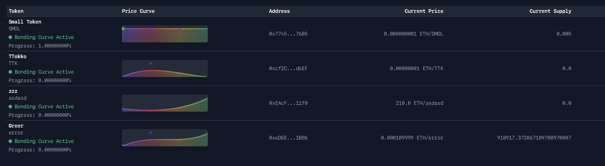

> :warning: **Development Status: Pre-audit & Non-Production** 
> These smart contracts are under active development, have not yet undergone a formal security audit, and are experimental in nature. We strongly advise against using this code in production environments at this stage.


# Glottis Protocol

A fair and transparent protocol for creating tokens with customizable price curves. Launch your token with confidence using mathematically elegant price discovery.

## What is Glottis?

Glottis Protocol combines the best of bonding curves with automated market making to create a fair token launch experience. It uses beautiful Bézier curves to control token pricing and ensures everyone gets an equal chance to participate.



## Key Features

### 🎨 Design Your Token Launch
- Create tokens easily with your own price curve
- Choose how aggressive or gradual you want the price to increase
- No special privileges - everyone plays by the same rules

### 📈 Smart Price Discovery
- Price follows a smooth curve divided into 100 equal steps
- Each step has a fixed amount of tokens at a predictable price
- No sudden jumps or unfair advantages

### 🔄 Automatic Trading
1. Initial Mint: Mint/Burn tokens as they follow your designed price curve
2. Liquidity Creation: Automatically creates a Uniswap trading pool
3. Open Trading: Free trading begins on Uniswap

### 🛡️ Fair Launch Guarantees
- Equal access for all participants
- Transparent pricing from start to finish
- No backdoors or special allocations
- Small fees to align incentives


# Development Setup Guide

## Local Environment Setup


1. Set the development rpc endpoint
```bash
export UNICHAIN_TESTNET_RPC_URL=https://sepolia.unichain.org/
```

### Testing

Run specific test with detailed output:
```bash
forge test --match-path test/Glottis20MintTest.t.sol -vvvv
```

**Test Results and Code Scanning**

For more information on our tests and code scanning, please refer to the following:

* [Actions](https://github.com/JohnnySheffield/glottis.contracts/actions)
* [Code Scanning](https://github.com/JohnnySheffield/glottis.contracts/security/code-scanning) 

## Tesnet Network Information

### Network IDs
- Unichain Testnet (Sepolia): 1301
- Unichain Mainnet: 130

### Uniswapv2 Deployed Contract Addresses (Unichain Sepolia)

| Contract            | Address                                    |
|--------------------|--------------------------------------------| 
| Factory            | 0x5C69bEe701ef814a2B6a3EDD4B1652CB9cc5aA6f |
| UniswapV2Router02  | 0x920b806E40A00E02E7D2b94fFc89860fDaEd3640 |

## Glottis Error Codes Reference

| Error Name             | Hex Code   |
|-----------------------|------------|
| MaxSupplyReached      | 0xd05cb609 |
| InvalidAmount         | 0x2c5211c6 |
| ETHTransferFailed     | 0xb12d13eb |
| InvalidPricePoints    | 0xbf8c0e9d |
| TokenNotFound         | 0xcbdb7b30 |
| InvalidInput          | 0xb4fa3fb3 |
| InsufficientPayment   | 0xcd1c8867 |
| InsufficientLiquidity | 0xbb55fd27 |
| InsufficientBalance   | 0xf4d678b8 |
| CurveNotCompleted     | 0x7ec3f157 |
| SlippageExceeded      | 0x8199f5f3 |


## Additional Info

### Trading Lifecycle
1. Initial Mint/Burn Phase
   - Price follows the defined Bézier curve
   - Tokens are minted progressively through 100 steps
   - Each step has a fixed amount of tokens at a fixed price
   - Small burn fee (0.35%) to discourage immediate dumping
   
2. Liquidity Creation
   - After initial sale completes, equal amount of tokens are minted for liquidity
   - Collected ETH is used to create a Uniswap V2 liquidity pool
   - Fair fee distribution between protocol, creator, and caller

3. Open Trading
   - Trading becomes unlocked after liquidity pool creation
   - Tokens can be freely traded on Uniswap


### Fee Structure
- Uniswap Pool Creation:
  - Protocol Fee: 0.20%
  - Creator Fee: 0.10%
  - Caller Fee: 0.05%
- Trading:
  - Burn Fee: 0.35%
  - Mint fee: 0.00%

## Technical Implementation

### Smart Contracts
- **Glottis20Mint**: the Mint contract handling token creation and sales
  - Manages token deployment
  - Handles bonding curve calculations
  - Controls minting and burning
  - Manages liquidity pool creation

- **Glottis20**: ERC20 implementation with additional features
  - Controlled minting through the Mint
  - Trading lock mechanism
  - Immutable supply and decimals

### Price Calculation
The protocol uses efficient mathematical implementations for Bézier curve calculations:
```solidity
// Cubic Bézier curve formula:
// P = (1-t)³P₀ + 3(1-t)²tP₁ + 3(1-t)t²P₂ + t³P₃
```


## License

This project is licensed under the Business Source License 1.1 (BUSL-1.1). See [LICENSE.md](LICENSE.md) for details.

### License Summary
- **Licensor:** Nikola Jokić
- **Licensed Work:** Glottis Protocol
- **Additional Use Grant:** Any uses listed and defined at https://glottis.fun/license-grants
- **Change Date:** 2027-01-01
- **Change License:** GNU General Public License v2.0 or later

### Use Limitations
- Commercial use and production deployment of the Licensed Work are not permitted
- Research, testing, and personal non-commercial use are permitted
- Additional use rights may be granted at https://glottis.fun/license-grants
